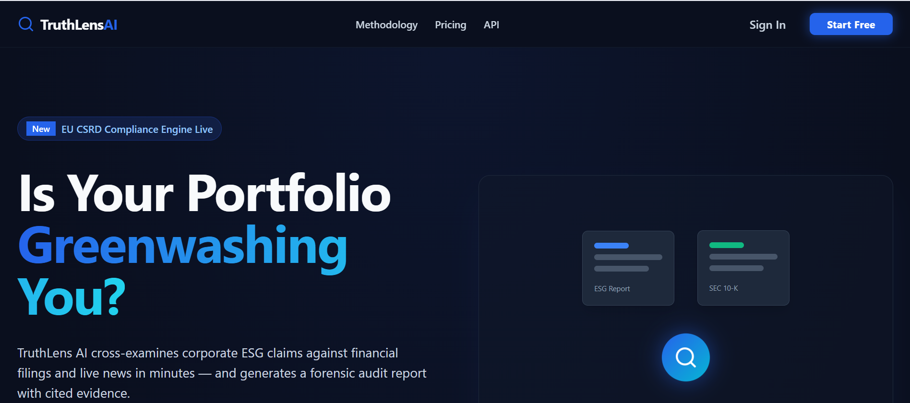
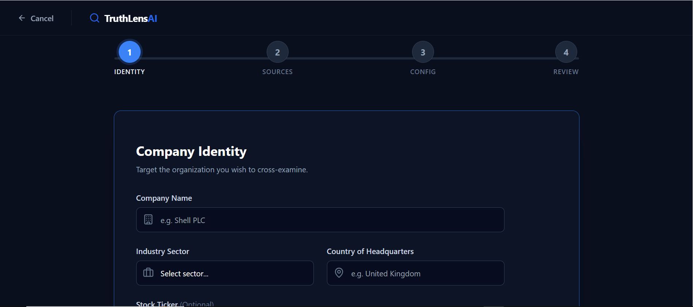
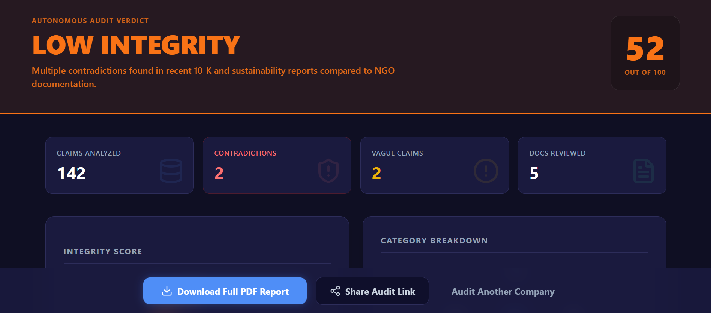

# TruthLens AI
An autonomous ESG forensic intelligence platform designed for deep-dive sustainability auditing and greenwashing detection.

## Tech Stack
-   **Frontend**: Next.js 14, React, Tailwind CSS, Recharts, Framer Motion
-   **Backend**: FastAPI, Python 3.10+, Uvicorn
-   **AI & Logic**: LangChain, FAISS (Vector Store), `sentence-transformers` (all-MiniLM-L6-v2)
-   **Reporting**: WeasyPrint, Jinja2 (for Big-4 quality PDF generation)
-   **Real-time**: WebSockets

## How to Run
It's incredibly simple to start the entire stack. From the `truthlens` folder, simply double-click the `start.bat` file! 
This will automatically launch the Next.js UI on `localhost:3000` and the FastAPI server on `localhost:8000`.

*If you prefer launching manually:*
**Backend**:
```bash
cd backend
venv\Scripts\activate
uvicorn main:app --reload --port 8000
```

**Frontend**:
```bash
cd frontend
npm run dev
```

## API Endpoints
### Document Ingestion & Auditing
-   `POST /api/audit/start` - Initialize a new multi-tenant audit sequence.
-   `POST /api/upload` - Securely ingest sustainability documents (.pdf, .txt, .html).
-   `POST /api/fetch-news` - Retrieve latest ESG controversies and press releases.
-   `POST /api/detect-contradictions` - Run semantic similarity matching and cross-reference extracted claims.

### Real-Time & Results
-   `WS /ws/audit/{id}/progress` - Stream live pipeline telemetry back to the React UI.
-   `GET /api/audit/{id}/results` - Aggregate forensic analysis into a clean flat JSON for UI charting.
-   `GET /api/red-flags` - Fetch the database of 30+ proprietary ESG greenwashing heuristics.
-   `GET /api/audit/{id}/report/pdf` - Stream the fully compiled evidence PDF back to the browser.
-   `GET /api/audits` - Retrieve the catalog of historical audits.

## Screenshots

### Landing Page


### New Audit Form


### Results Dashboard

